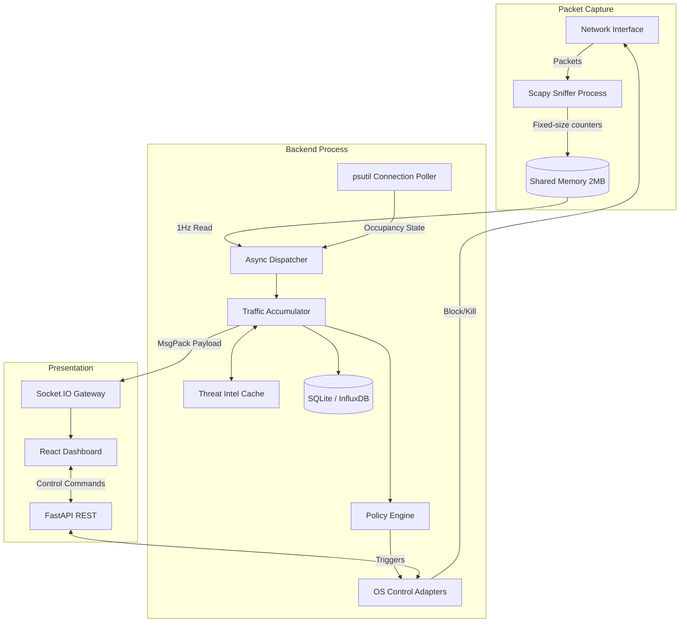

# Port Sentinel

> **High-performance real-time network visibility and administrative control system.**

[](https://www.python.org/)
[](https://fastapi.tiangolo.com/)
[](https://reactjs.org/)
[](https://opensource.org/licenses/MIT)

## 2. Overview

**Port Sentinel** is an endpoint-focused active response and visibility console designed for system administrators, blue team operators, and security researchers.

It solves the problem of "blind" endpoints by capturing live network traffic, mapping it to running processes in real-time, and enriching remote connections with threat intelligence. More than just an observability tool, Port Sentinel provides a **Control Plane** that allows operators—or an automated policy engine—to instantly kill/suspend malicious processes or hard-block suspicious network ports via native OS firewalls.

**Business & Technical Value:**
- **Zero-Latency Visibility:** Bypasses heavy logging agents by sniffing packets directly at the interface and sharing data via ultra-fast memory maps.
- **Immediate Mitigation:** Cut off attackers instantly without waiting for EDR (Endpoint Detection and Response) cloud syncs.
- **Automated Defense:** Local policy engine can automatically severe connections when traffic spikes or high-risk IPs are detected.

---

## 3. Key Features

### 🛡️ Security & Control Features
- **Process Manipulation:** Suspend, resume, or kill running processes mapped to active network sockets.
- **Native Firewall Integration:** Hard-block inbound/outbound traffic on specific ports using native OS firewalls (Windows `netsh`, macOS `pfctl`).
- **Safety Guardrails:** Hardcoded protections prevent operators from accidentally killing critical system processes (e.g., PID 0, 4).

### ⚡ Performance Features
- **Shared Memory IPC:** Scapy sniffer runs in a dedicated process and writes to a 2MB fixed-size shared memory block, avoiding Python GIL locks and serialization overhead.
- **Binary WebSocket Streaming:** Pushes real-time updates at 1Hz using `MsgPack` for minimal bandwidth usage.
- **DOM Virtualization:** The React frontend uses `@tanstack/react-virtual` to smoothly render thousands of active connections without frame drops.

### 🤖 Intelligence & Automation
- **Automated Policy Engine:** Define rules to automatically trigger blocks/kills based on bandwidth thresholds, risk scores, or specific application behaviors.
- **IP Threat Enrichment:** Resolves remote IP metadata (Organization, Country, Risk Score) via integrated Threat Intel (ipinfo.io).

### 📊 Observability
- **Traffic Accumulation:** Calculates accurate KB/s metrics (Inbound/Outbound) over sliding time windows.
- **Time-Series Persistence:** Stores historical data locally in SQLite, with optional automated syncing to InfluxDB.
- **Audit Logging:** Every manual or policy-driven mitigation action is heavily audited.

---

## 4. Architecture

Port Sentinel utilizes a dual-plane architecture combining a low-level packet sniffer with a high-concurrency API server.

### Data Flow & Component Interaction



### Architectural Decisions & Tradeoffs
- **Multiprocessing over Async for Sniffing:** Packet sniffing is extremely CPU-bound. By isolating Scapy in a separate process and using `multiprocessing.shared_memory`, the FastAPI event loop remains entirely unblocked for handling API requests and WebSocket broadcasts.
- **psutil Fallback:** Since `Scapy` requires elevated privileges and can sometimes miss instantaneous connection states, the dispatcher merges real traffic counters from the sniffer with process occupancy state from `psutil`. This ensures the UI always shows open ports, even if traffic is zero.
- **Local SQLite First:** To maintain zero-dependency operations, SQLite is the primary datastore. InfluxDB is supported via an asynchronous writer for enterprise environments.

---

## 5. Tech Stack

### Backend
| Technology | Purpose |
|------------|---------|
| **Python 3.10+** | Core runtime |
| **FastAPI / Uvicorn** | High-performance async API server |
| **Scapy** | Raw network packet capture |
| **psutil** | Process introspection and network connection mapping |
| **Python-SocketIO** | Bidirectional real-time event streaming |
| **MsgPack** | High-efficiency binary serialization |

### Frontend
| Technology | Purpose |
|------------|---------|
| **React 18** | UI framework |
| **TypeScript** | Type-safe frontend logic |
| **Vite** | Build tooling and dev server |
| **@tanstack/react-virtual** | High-performance table rendering |
| **Recharts** | Analytics and time-series charting |

### Storage & Infrastructure
| Technology | Purpose |
|------------|---------|
| **SQLite (aiosqlite)** | Default embedded persistent storage |
| **InfluxDB Client** | Optional time-series metrics sink |
| **Docker / Nginx** | Containerized deployment options |

---

## 6. Folder Structure

```text
Port-Sentinel/
├── backend/                  # FastAPI + Socket.IO backend and OS control layer
│   ├── main.py               # App entrypoint, orchestration, API endpoints
│   ├── core/
│   │   ├── sniffer.py        # Scapy packet capture + shared memory writer
│   │   ├── metrics.py        # Byte delta -> KB/s logic + cache
│   │   ├── db.py             # SQLite + InfluxDB + Supabase classes
│   │   ├── policies.py       # Automation policy engine
│   │   ├── threat_intel.py   # IP enrichment + risk scoring
│   │   ├── watchdog.py       # Auto-restart monitor
│   │   └── exceptions.py     # Domain exceptions (safety/control errors)
│   ├── os_adapters/
│   │   ├── win32_bridge.py   # Windows process + firewall controls
│   │   ├── darwin_bridge.py  # macOS process + pfctl controls
│   │   └── android_bridge.kt # Experimental mobile bridge
│   └── data/                 # Local SQLite DB files
├── frontend/                 # React + TypeScript dashboard
│   ├── src/
│   │   ├── pages/            # Main views (dashboard, processes)
│   │   ├── components/       # Reusable UI components
│   │   ├── hooks/            # Socket context and custom hooks
│   │   └── services/         # API clients
│   ├── package.json          # Frontend dependencies
│   └── nginx.conf            # Reverse-proxy config for container
├── tests/                    # Unit, integration, safety, and stress tests
├── pyproject.toml            # Python dependencies and metadata
├── docker-compose.yml        # Multi-service deployment
├── run.bat                   # Windows startup script
└── run.sh                    # Unix/macOS startup script
```

---

## 7. Installation & Setup

**Crucial Note:** Port Sentinel relies on deep OS integration (packet sniffing, firewall modification, process termination). It is highly recommended to run the backend **natively** on your host OS with elevated privileges. 

### Prerequisites
- Python 3.10 or higher
- Node.js 20+
- Administrator (Windows) or Sudo (macOS/Linux) privileges

### 1. Clone the Repository
```bash
git clone https://github.com/your-org/port-sentinel.git
cd port-sentinel
```

### 2. Environment Configuration
Create a `.env` file in the root directory.

```bash
cp .env.example .env
```

### 3. Native Local Development (Recommended)

**Windows:**
Open PowerShell or Command Prompt **as Administrator**.
```bat
run.bat
```

**macOS/Linux:**
```bash
sudo ./run.sh
```
*(The scripts handle virtual environment creation, pip installs, npm installs, and starting both servers concurrently.)*

- Frontend URL: `http://localhost:5173`
- Backend API: `http://localhost:8600`

### 4. Docker Deployment
While Docker is supported, it limits the backend's ability to manipulate host OS firewalls and processes. It is useful for UI development or read-only monitoring (requires `NET_ADMIN` capabilities).

```bash
docker compose up --build
```
- Dashboard: `http://localhost:8080`

---

## 8. Environment Variables

| Variable | Purpose | Required | Example |
| -------- | ------- | -------- | ------- |
| `HOST` | IP address to bind the API server | No | `0.0.0.0` |
| `PORT` | Port for the API server | No | `8600` |
| `IPINFO_TOKEN` | Token for IP geolocation & threat scoring | No | `your_token` |
| `INFLUXDB_URL` | URL to InfluxDB for time-series export | No | `http://localhost:8086` |
| `INFLUXDB_TOKEN` | Authentication token for InfluxDB | No | `your_token` |
| `INFLUXDB_ORG` | InfluxDB Organization | No | `sentinel_org` |
| `INFLUXDB_BUCKET`| InfluxDB Bucket name | No | `network_metrics` |
| `SUPABASE_URL` | URL for Supabase remote sync | No | `https://xyz.supabase.co` |
| `SUPABASE_KEY` | Supabase anon/service key | No | `your_jwt_key` |

---

## 9. Usage

Once the application is running:

1. **Dashboard Overview:** View live connections, traffic rates, and risk scores. The table updates at 1Hz.
2. **Process Management:** Click on any active process row to view options to **Suspend**, **Resume**, or **Kill** the process.
3. **Firewall Control:** Click on a port to initiate a **Hard Block**. This writes a native OS firewall rule prefixed with `Sentinel_` to drop all traffic on that port.
4. **Analytics:** View historical traffic spikes and top-talkers in the analytics tabs.
5. **Auditing:** All actions taken through the UI or triggered by the Policy Engine are recorded in the `audit_logs` table.

---

## 10. API Documentation

Base URL: `http://localhost:8600`
Interactive Swagger UI: `http://localhost:8600/docs`

### Key Endpoints

| Method | Endpoint | Description |
|--------|----------|-------------|
| `GET` | `/api/health` | System liveness, uptime, tracked port count. |
| `GET` | `/api/ports` | Current live port table (REST fallback for WS). |
| `GET` | `/api/ports/{port}/history` | Historical traffic snapshots (query `?hours=24`). |
| `POST` | `/api/control/kill/{pid}` | Terminates a process. Returns 403 if it is a protected system PID. |
| `POST` | `/api/control/block/{port}` | Adds an OS firewall rule (TCP/UDP). |
| `POST` | `/api/control/unblock/{port}` | Removes the `Sentinel_` firewall rule. |
| `GET` | `/api/audit/logs` | Fetch recent security and policy actions. |

### WebSocket Protocol
Connect a Socket.IO client to `/ws`. The server emits a `port_table` event containing a `MsgPack` encoded array of active connections every 1 second.

---

## 11. Security

- **System PID Protection:** The backend OS adapters actively refuse to kill or suspend critical processes (e.g., PID `0` or `4` on Windows, `0` or `1` on macOS) throwing a `SystemProcessProtectionError`.
- **Namespaced OS Rules:** All firewall rules created by the system are prefixed with `Sentinel_`. On graceful shutdown (via `atexit` hooks), the system automatically cleans up its own rules to ensure no ports are permanently blocked by accident.
- **Audit Logging:** Every destructive action (kill/block) is recorded locally in SQLite with a timestamp, target, and reason (User action vs. Policy trigger).
- **Execution Context:** The application requires elevated privileges (`sudo` / Admin). By default, it binds to `0.0.0.0` but should only be exposed locally (`127.0.0.1`) or via a secure VPN/Tunnel in a production setting.

---

## 12. Performance Optimization

- **Zero-Copy IPC:** Uses `multiprocessing.shared_memory` to transfer high-frequency packet counters from the Scapy sniffer process to the main API loop. This bypasses the Python Global Interpreter Lock (GIL) and avoids expensive JSON/Pickle serialization.
- **MsgPack over WebSockets:** Live port tables are pushed to the frontend using binary `MsgPack` compression, significantly reducing network overhead compared to JSON.
- **Frontend DOM Virtualization:** The React dashboard utilizes `@tanstack/react-virtual`. Instead of rendering 5,000 DOM rows for 5,000 active connections, it only renders the ~20 rows currently visible in the user's viewport.

---

## 13. Testing

Port Sentinel uses `pytest` for a multi-tiered testing strategy.

```bash
cd backend
pytest -v
```

**Test Suites (`tests/`):**
- **Unit (`unit/`):** Logic tests for metrics calculations and policy engine rule evaluation.
- **Integration (`integration/`):** Tests the async dispatcher and shared memory merging logic.
- **Safety (`safety/`):** Ensures that OS Adapters refuse to operate on protected PIDs and properly format firewall commands without executing them.

---

## 14. Screenshots

- **Live Traffic Dashboard**
  

- **Process Analytics & Drilldown**
  

- **Interactive Settings**
  

- **Policy Manager**
  

- **Blocked Connections Overview**
  

- **Detailed Telemetry Streams**
  

---

## 15. Roadmap

- [ ] **Linux `iptables`/`ufw` Support:** Add full `linux_bridge.py` support for blocking ports natively on Ubuntu/Debian servers.
- [ ] **Custom Policy Builder:** Implement a UI for operators to drag-and-drop policy rules (e.g., "If Outbound KB/s > 5000 AND Risk > 80 -> Block Port").
- [ ] **eBPF Sniffer:** Replace Scapy with an eBPF-based sniffer for kernel-level packet capture, further reducing CPU overhead.
- [ ] **Authentication:** Add JWT-based login for exposing the dashboard over networks safely.

---

## 16. Troubleshooting

**Error: "Access denied reading net_connections" or Sniffer fails to start.**
**Fix:** You must run the backend with elevated privileges. Open your terminal as Administrator (Windows) or use `sudo` (Linux/macOS).

**Error: `The token '&&' is not a valid statement separator` (Windows PowerShell)**
**Fix:** If you are running commands manually in PowerShell, use `;` instead of `&&`. The provided `run.bat` script handles this correctly.

**Error: Changes made to code are not reflecting.**
**Fix:** The frontend uses Vite with Hot Module Replacement (HMR). The backend uses Uvicorn. Ensure you are passing the `--reload` flag to Uvicorn if starting it manually.

---

## 17. Contributing

1. Fork the project.
2. Create your feature branch (`git checkout -b feature/AmazingFeature`).
3. Ensure you do not break the safety protections in `os_adapters/`.
4. Run the test suite: `pytest`.
5. Commit your changes (`git commit -m 'feat: Add AmazingFeature'`).
6. Push to the branch (`git push origin feature/AmazingFeature`).
7. Open a Pull Request.

---

## 18. License

Distributed under the MIT License. See `LICENSE` for more information.

---

## 19. Acknowledgements

- Network packet analysis powered by [Scapy](https://scapy.net/).
- System introspection via [psutil](https://github.com/giampaolo/psutil).
- Fast binary serialization using [MsgPack](https://msgpack.org/).