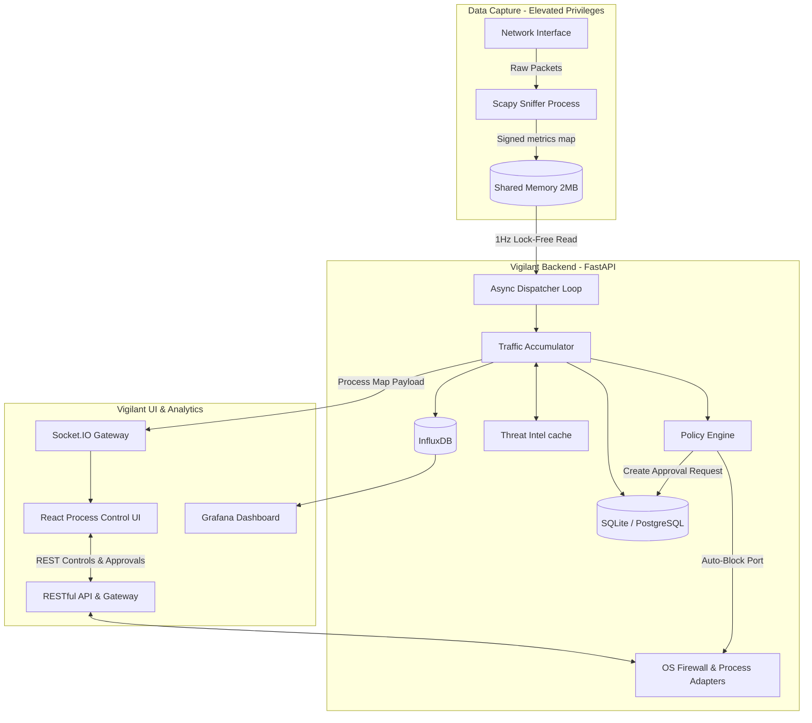

# Vigilant Enterprise Network Defense

> **Production-grade active network traffic visibility, threat detection, and analyst response control console.**

[](https://www.python.org/)
[](https://fastapi.tiangolo.com/)
[](https://reactjs.org/)
[](#)

---

## 1. Overview

**Vigilant Enterprise Network Defense** is an endpoint-focused active response and visibility console designed for system administrators, security analysts (blue team operators), and enterprise operations teams. 

Vigilant solves the problem of "blind" endpoints by capturing live network traffic, mapping it to active processes in real-time, and enriching remote connections with threat intelligence. Going beyond passive monitoring, Vigilant implements an **Analyst-in-the-Loop Control Plane** allowing operators or an automated policy engine to:
1. **Hard-block suspicious network ports** natively using local OS firewalls.
2. **Initiate an Analyst Approval workflow** to review and request process actions (such as suspending or resuming anomalous applications) without exposing automated endpoints to process manipulation exploits.

### Key Value Propositions
- **Zero-Latency Network Mapping:** Isolates raw packet sniffing to a dedicated sub-process writing directly to an HMAC-signed shared memory map, completely bypassing Python's GIL.
- **Analyst-in-the-Loop Mitigation:** Prevents automated denial-of-service risks by running all process interventions through a structured review queue requiring explicit operator authorization.
- **Enterprise Ready & Cross-Platform:** Native adapters implement firewalls and process resolution uniformly across Windows (`netsh`), macOS (`pfctl`), and Linux (`nftables`/`iptables`/`ufw`).

---

## 2. Architecture

Vigilant utilizes a decoupled, high-performance architecture split into a low-level packet capture plane and a high-concurrency control API.

### Data Flow & Component Interaction



### Key Architectural Decisions
- **Multiprocessing IPC:** High-speed packet capturing is extremely CPU-bound. Isolating the Scapy packet sniffer to its own process allows FastAPI to handle hundreds of concurrent WebSocket and REST operations smoothly.
- **HMAC Shared Memory Signatures:** To guarantee that local processes cannot inject fake metrics, the shared memory block is validated using a HMAC-SHA256 signature generated with an instance-specific key.
- **Lock-Free Reads:** The async dispatcher reads the shared memory block using a lock-free verification pass. If a partial write is caught by the HMAC check, it retries in the next millisecond, eliminating read/write lock contention.

---

## 3. Tech Stack

### Core Platform
- **Backend:** Python 3.12+, FastAPI, Uvicorn, SQLAlchemy ORM
- **Frontend:** React 18, TypeScript, Vite, Vanilla CSS
- **Observability:** Grafana 10+, InfluxDB 2.7
- **IPC:** multiprocessing.shared_memory, msgpack-python, @msgpack/msgpack
- **Packet Sniffing:** Scapy (low-level network captures)
- **Database:** SQLite (WAL mode) / PostgreSQL (via SQLAlchemy dialect auto-detection)

### Infrastructure
- **Docker:** Multi-stage Dockerfiles utilizing non-root users, security scans, and `compose` templates.
- **CI/CD:** GitHub Actions workflow verifying macOS, Linux, and Windows matrix builds.

---

## 4. Installation & Deployment

Vigilant requires elevated system privileges to sniff packets and adjust local firewalls.

### Native Installation (Recommended)

#### Prerequisites
- **Python 3.10+** (Python 3.12 recommended)
- **Node.js 20+**
- **Administrator Privileges** (Windows Command Prompt run as Administrator, or Linux/macOS `sudo`)

#### Windows Setup
1. Clone the repository.
2. Open Command Prompt **as Administrator**.
3. Run the installer:
   ```cmd
   scripts\install.bat
   ```
4. Copy the environment template and set your configuration details (especially `VIGILANT_JWT_SECRET` and admin password):
   ```cmd
   copy .env.example .env
   ```
5. Launch the application background servers:
   ```cmd
   scripts\start.bat
   ```
6. To stop the services:
   ```cmd
   scripts\stop.bat
   ```
7. To update dependencies and check for codebase changes:
   ```cmd
   scripts\update.bat
   ```

#### Linux & macOS Setup
1. Clone the repository and enter the directory.
2. Run the installer:
   ```bash
   ./scripts/install.sh
   ```
3. Create your local configuration:
   ```bash
   cp .env.example .env
   ```
4. Launch the services (requires sudo for raw network capturing):
   ```bash
   sudo ./scripts/start.sh
   ```
5. To stop the services:
   ```bash
   sudo ./scripts/stop.sh
   ```
6. To pull updates and refresh dependencies:
   ```bash
   ./scripts/update.sh
   ```

---

## 5. Environment Variables

Create a `.env` file in the root directory to configure the application:

| Variable | Description | Default |
|----------|-------------|---------|
| `HOST` | Bind address for the backend server | `127.0.0.1` |
| `PORT` | Bind port for the backend server | `8600` |
| `VIGILANT_JWT_SECRET` | Secret key used to sign JWT session tokens (production critical) | *Autogenerated on start if empty* |
| `VIGILANT_ADMIN_PASSWORD` | Seeds the default `admin` user's password on first run | *Autogenerated on start if empty* |
| `DATABASE_URL` | SQLAlchemy connection string (SQLite/PostgreSQL) | `sqlite:///data/sentinel.db` |
| `LOG_STORAGE_PATH` | Directory where security and audit logs are archived | `logs` |
| `LOG_ENCRYPTION_KEY` | AES-256 Fernet key for encrypting archived logs at rest | *Disabled if empty* |
| `IPINFO_TOKEN` | Geolocation and ASN enrichment API key (from ipinfo.io) | *Offline fallback if empty* |

---

## 6. Features & Usage Guide

Once the application is running, navigate your web browser to the frontend dashboard:
- **Local Dev Server:** `http://localhost:5173/`
- **Backend-Served SPA:** `http://127.0.0.1:8600/`

### 1. Operational Dashboard
- **Real-Time Throughput Widget:** Displays inbound and outbound network throughput in a sliding 60-second window.
- **Top Talkers Widget:** Identifies high-bandwidth applications on the system.
- **System Health:** Tracks active sniffer logs, monitored ports, and host system uptime.
- **Pending Approvals Queue:** Allows analysts to approve or reject process action requests.

### 2. Global Traffic Control
- The central grid displays all active network ports, mapping them to the binding PID and application name.
- Click **Block** to create a native OS firewall rule dropping inbound/outbound packets on that port.
- Click **Suspend** to request an Analyst Approval ticket. The action is queued in the review board.

### 3. Global Threat Globe
- Under **Global Threat**, Vigilant renders an interactive 3D Globe displaying geographical mapping of remote threat locations using animated connection arcs.
- The interface supports time-scrubbing controls and risk-threshold filtering.

---

## 7. Security & Compliance

- **No Remote Kill Execution:** The platform implements zero endpoints that allow remote API clients to kill or suspend host processes directly. All process operations go through a database-persisted queue reviewed by human analysts.
- **System Protection Guards:** OS Bridges hard-reject block/approval actions targeting critical system PIDs (such as PID `0`, `4` on Windows or `1` on Linux/macOS) to prevent denial of service.
- **Audit Trails:** Every firewall modification, analyst approval resolution, and user login is written to the audit log database with session correlation identifiers.

---

## 8. Development & Testing

We use `pytest` to verify backend security, stress, and adapter features.

### Running Backend Tests
Activate your virtual environment and execute:
```bash
python -m pytest tests/ -v --tb=short
```

### Frontend Build
Compile the React bundle:
```bash
cd frontend
npm run build
```

---

## 9. License

This project is licensed under the MIT License. See `LICENSE` for details.