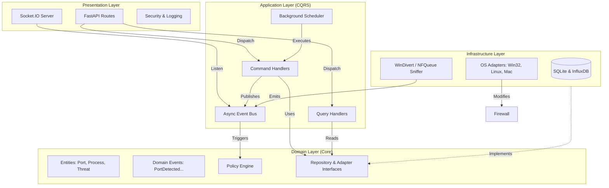

# Port Sentinel Architecture

Vigilant Port Sentinel follows a strict Clean Architecture pattern combined with CQRS (Command Query Responsibility Segregation) and an Event-Driven domain layer.

## System Diagram

## Layer Responsibilities

### 1. Presentation
The outermost layer. It contains the FastAPI application, REST endpoints, Socket.IO gateway, and security middleware. It only communicates with the Application layer via Command/Query dispatch.

### 2. Application
The orchestration layer. It contains Use Cases defined as Commands (write operations) and Queries (read operations). It also manages the Event Bus for asynchronous pub/sub messaging across domains.

### 3. Domain
The core business logic. It contains Entities (Ports, Processes, Rules), Value Objects, and Domain Events. The Policy Engine resides here, evaluating domain states without any knowledge of the database or OS.

### 4. Infrastructure
The concrete implementation layer. It contains the database repositories (SQLAlchemy wrapper), OS-specific adapters (Windows, Linux, macOS bridges), and the high-performance packet sniffer wrapper.

## Inter-Process Communication (IPC)
The packet sniffer runs as an elevated background process. It writes port accumulation metrics directly to a Shared Memory segment. The main FastAPI process reads this memory at 10Hz to broadcast real-time updates via WebSockets, completely bypassing database I/O for real-time traffic monitoring.
